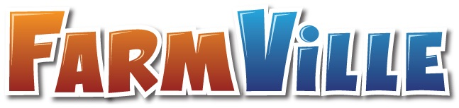

# FarmVille Revive
<!--  -->

> FarmVille 1 officially closed December 31th, 2020

The **FarmVille Revive** project by SulivanM. This project is a modern, optimized fork of the original FarmVille 1 preservation project, dedicated to keeping the game playable today.

[](https://github.com/SulivanM/Farmvillager-Revive/releases/latest)
[](https://discord.gg/Bm2EkN5vhz)

---

## Features (Revive Edition)
- **Optimized Python Code**: Refactored for better performance and modern compatibility (Python 3.14+).
- **Fast CDN**: Assets are served from a dedicated high-speed server (`cdnalpha.ttron.eu`).
- **Clean Base**: Removed legacy comments and debug overhead for a production-ready experience.

## Releases

| Version | Release date | Source | Download |
| --- | --- | --- | --- |
| **Revive 1.0** | April 2026 | :label: [tag](https://github.com/SulivanM/Farmvillager-Revive/releases/tag/v1.0) | :package: [Bundle](https://github.com/SulivanM/Farmvillager-Revive/releases/download/v1.0/farmvillager-revive.zip) |

| :information_source: | This version uses a custom CDN for assets (approx. 17 GB). The server will automatically download and extract them on the first run. |
| --- | :--- |

## Reporting Bugs and Contacting

:speech_balloon: Check our [Discord group](https://discord.gg/Bm2EkN5vhz)

:paw_prints: Original Project: [AcidCaos/farmvillage](https://github.com/AcidCaos/farmvillage)

## How to Install

- Download a flash-compatible browser. :flashlight: Options can be found [here](FLASH.md).
- Download the latest version from the [Releases](#releases) section.
- Extract the zip file and run the server.

## How to Play

- Run `python server.py`.
- Open your flash browser and navigate to `http://127.0.0.1:5500/`.

## External Links

:penguin: [FarmVille on GNU/Linux](LINUX.md)
:flashlight: [Flash Continuation](FLASH.md) documentation
:beginner: [FarmVille 1 Wiki (FANDOM)](https://farmville.fandom.com/wiki/FarmVille_Wiki)

---

## License [](http://www.gnu.org/licenses/gpl-3.0)

```
FarmVille Revive Project.
Based on the preservation work by AcidCaos and the Farm Village team.
Optimized and Maintained by SulivanM.
```
